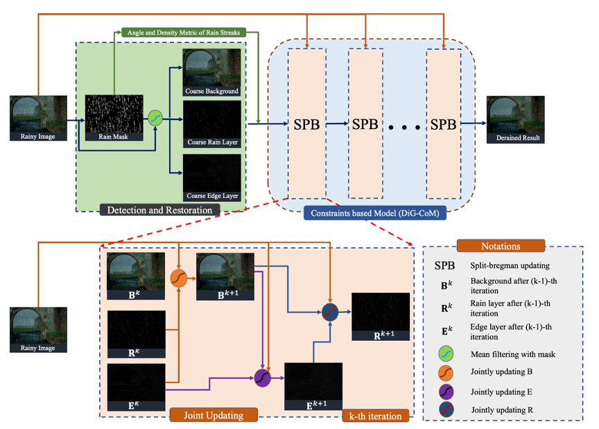
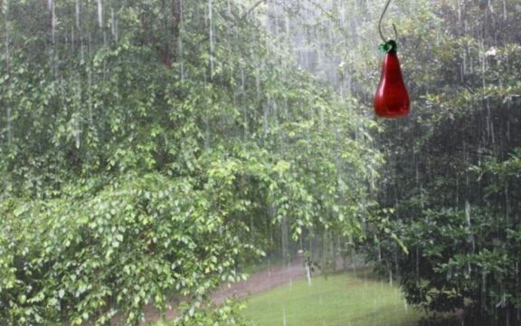
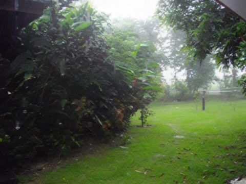
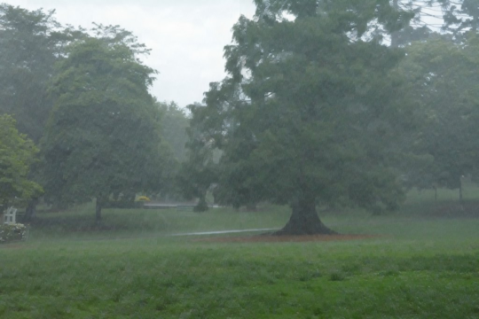
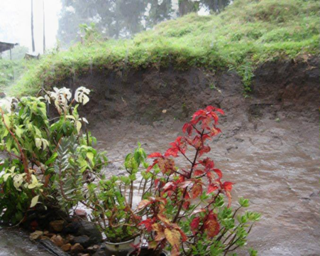
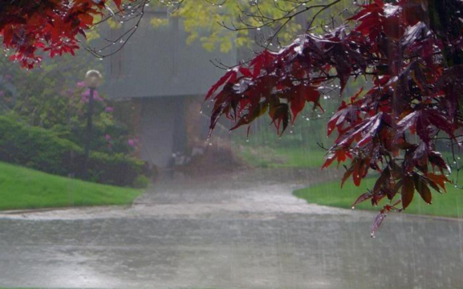

# Single Image Rain Removal Boosting via Directional Gradient (ICME'20)
[paf TAB]

[Wu Ran](https://github.com/Schizophreni), [Youzhao Yang](https://nnuyi.github.io/), and [Hong Lu](http://homepage.fudan.edu.cn/honglu/)

# Abstract
Image rain removal has been widely studied with traditional methods and learning based methods for years. However, traditional methods like Gaussian mixture model and dictionary learning methods are time consuming and fail to well tackle images with heavy rain streaks since image patches are severely contaminated. By considering the line-like property and angle distribution of rain streaks, this problem can be well solved. In this paper, by introducing Directional Gradient operator of arbitrary direction, we propose an efficient and robust Constraints based Model (DiG-CoM) for single image rain removal. Moreover, a density metric of rain streaks is applied to generalize the proposed model to light and heavy rain streak occasions. Extensive experiments on synthetic datasets demonstrate that the proposed model outperforms GMM and JCAS while requiring less time. Furthermore, on real-world occasions, the proposed method obtains better generalization ability compared with the state-of-the-art learning based methods. 

<div align="center">
    
</div>


# Usage
<font face="Times New Roman">use demo.m to run the deraining demo.
You can test your own img by adding you image to folder imgs, note that the format should be .png, or you can change the format in demo.m to .jpg format or other formats.</font>

>* Source code of the ICME2020 oral accepted paper: Single Image Deraining Boosting via Directional Gradient
>* C/MATLAB
>* Optimization based efficient method
>* Some details or errors will be released later
>* Have implemented a fast bilateral filter and a mean filter for obtaining a coarse result

# Derained Result
Some visual results of real scene

<div align="center">
    
</div>

<div align="center">
    
</div>

# Citation
```
@inproceedings{ran2020single,
      title={Single Image Rain Removal Boosting via Directional Gradient},
      author={Ran, Wu, Yang, Youzhao and Lu, Hong},   
      booktitle={IEEE International Conference on Multimedia and Expo (ICME)},
      year={2020}
}
```